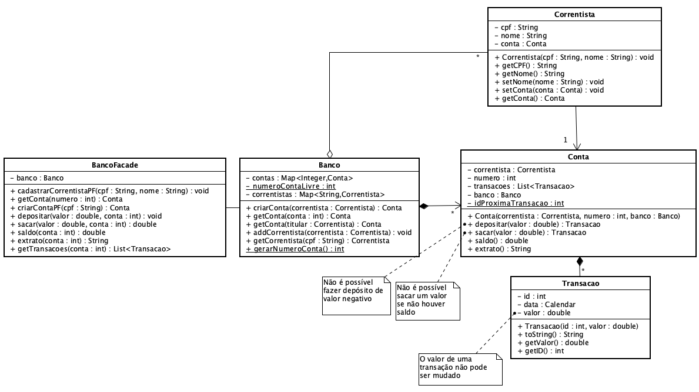

**Universidade Federal da Paraíba - UFPB** \
**Centro de Ciências Exatas e Educação - CCAE** \
**Departamento de Ciências Exatas - DCX**

**Professor:** [Rodrigo Rebouças de Almeida](http://rodrigor.dcx.ufpb.br)

# Atividade 03 - Banco v1

Entidades: Banco, Correntista, Conta e Transação

* Padrões: Façade
* Conceitos OO: Composição, agregação, encapsulamento

Implemente as classes especificadas no diagrama a seguir.

Considere as seguintes regras em sua implementação:

